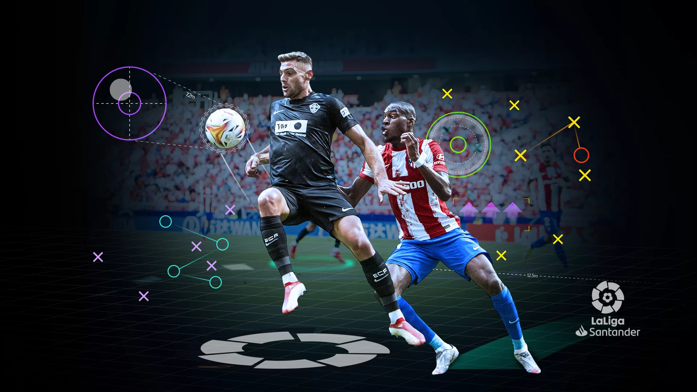
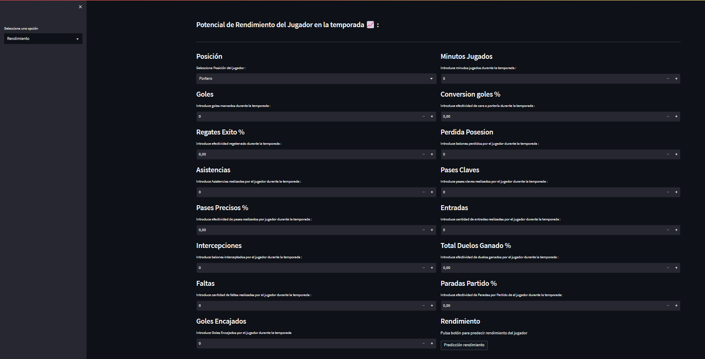
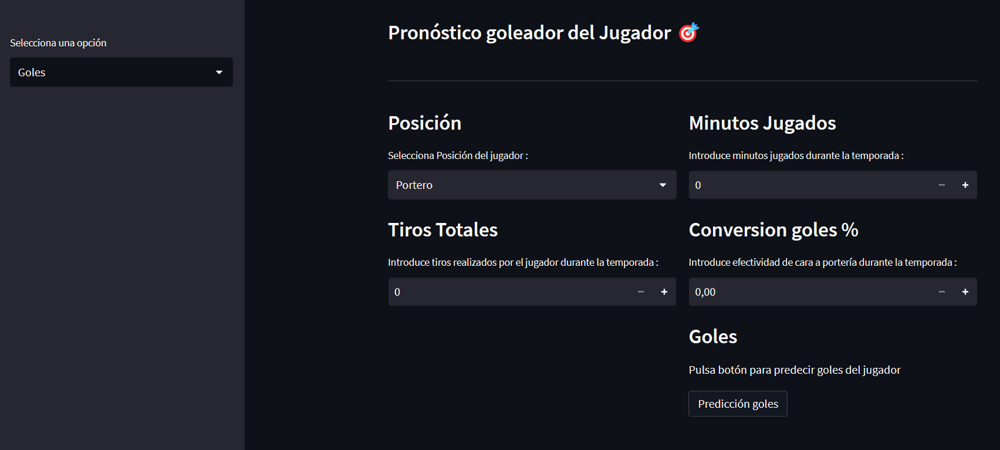
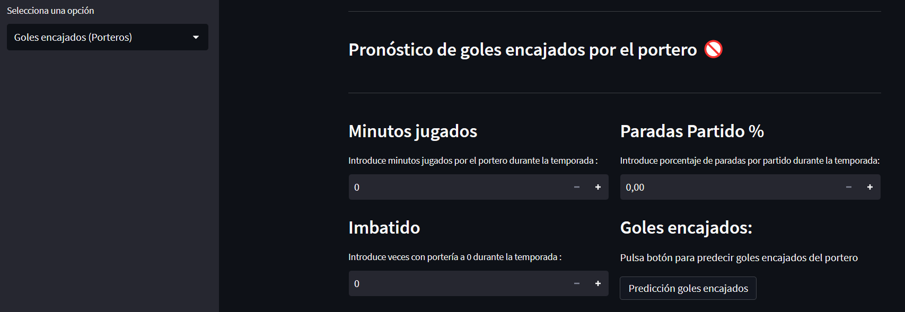

&nbsp;&nbsp;&nbsp;&nbsp;&nbsp;&nbsp;&nbsp;&nbsp;&nbsp;&nbsp;&nbsp;&nbsp;&nbsp;&nbsp;&nbsp;&nbsp;&nbsp;&nbsp;
# [Descubriendo el talento a través del arte del análisis deportivo ⚽📊 **(ScoutLiga)**](https://jaimesalado-scouting-ligasantander-app-gl1w4o.streamlit.app/ "Descubriendo el talento a través del arte del análisis deportivo ⚽📊 **(ScoutLiga)**")

TFM Malaga Tech Park IA y Bigdata  realizado por **Jaime Salado Muñoz**.
  

# 1. Justificación y descripción del proyecto.

El Proyecto **scoutLiga** se justifica por la necesidad de mejorar la toma de decisiones en el proceso de fichaje de jugadores en los equipos de fútbol de la Liga Profesional Española **(Laliga Santander)**. En este proceso, los equipos necesitan evaluar el rendimiento de los jugadores para identificar a aquellos que tienen el potencial de mejorar su desempeño en el campo y, por lo tanto, contribuir al éxito del equipo.

 

El objetivo de este proyecto es utilizar técnicas de análisis de datos y aprendizaje automático para predecir el rendimiento de un jugador de fútbol en la Laliga. Se recopilarán y analizarán datos de los jugadores de la temporada **2021/2022**, incluyendo su equipo, su posición y su desempeño en el campo.
 

La solución resultante permitirá a los equipos de fútbol de la Laliga mejorar su proceso de scouting, identificar a los jugadores que tienen el potencial de tener un mejor desempeño en el campo y tomar decisiones de fichaje más informadas.

 

Además se introducirá sintesis de voz para que podamos escuchar el resultado final de la predicción y no tengamos que leerlo.

